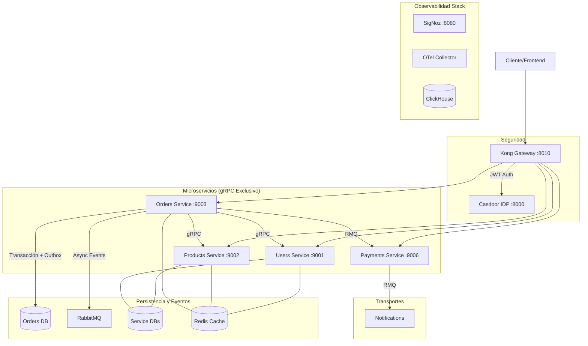

# 📖 Guía Detallada: Configuración del Ecosistema

Esta guía explica paso a paso cómo levantar el ambiente completo de forma manual. Esto es útil para entender las dependencias entre servicios y personalizar la configuración.

---

## 🛠️ Fase 1: Entorno y Clonado

1. **Clonar el repositorio:**
   ```bash
   git clone <url-del-repo>
   cd nestjs-microservices
   ```
2. **Prerrequisitos:**
   - **Docker Desktop** (con Docker Compose).
   - **Node.js >= 18** y **pnpm** (para comandos locales de Prisma).
3. **Variables de Entorno (`.env`):**
   - Copia `.env.example` a `.env` en la raíz.
   - En cada carpeta de microservicio (`users`, `products`, etc.), copia su `.env.example` a `.env`.
   - > [!IMPORTANT]
     > En la raíz `.env`, asegúrate de que `CASDOOR_ENDPOINT` sea `http://localhost:8000`.

---

## 🏗️ Fase 2: Infraestructura de Datos

Primero, levantamos los servicios que los microservicios necesitan para arrancar:

```bash
docker-compose up -d users-db products-db orders-db payments-db cart-db redis rabbitmq
```

**Verificación:** Ejecuta `docker-compose ps` y asegúrate de que todas las bases de datos digan `(healthy)`.

---

## 📑 Fase 3: Esquema de Datos (Prisma)

Con las bases de datos listas, aplicamos el esquema y los datos iniciales (Seeds) para tener productos y usuarios de prueba.

**Ejecución vía Docker (Recomendado):**
```bash
# Repetir para cada servicio (users, products, orders)
docker-compose run --rm users-service npx prisma migrate deploy
docker-compose run --rm users-service npx prisma db seed

docker-compose run --rm products-service npx prisma migrate deploy
docker-compose run --rm products-service npx prisma db seed

# Payments y Cart solo requieren migrate (sin seed)
docker-compose run --rm payments-service npx prisma migrate deploy
docker-compose run --rm cart-service npx prisma migrate deploy
```

---

## 🔐 Fase 4: Identidad (Casdoor)

Levantamos el proveedor de identidad para habilitar la autenticación.

```bash
docker-compose up -d casdoor-db casdoor
```

1. Accede a `http://localhost:8000` (`admin` / `123123`).
2. **Organización:** En **Identity > Organizations**, edita `built-in` y activa **"Enable privilege consent"**.
3. **Aplicación:** En **Identity > Applications**, edita `app-built-in`.
   - Añade `http://localhost:3000/callback` en **Redirect URLs**.
   - Habilita `Authorization Code` y `Password`.
4. **Sincronización de Keys:** Ejecuta el script para que Kong obtenga la llave pública de Casdoor:
   - Windows: `./scripts/fetch-casdoor-certs.ps1 -UpdateConfig`
   - Linux/macOS: `sh scripts/fetch-casdoor-certs.sh -UpdateConfig` (ajustar según disponibilidad).

---

## 📊 Fase 5: Observabilidad y Gateway

```bash
# Levantar SigNoz y Kong
docker-compose up -d signoz signoz-otel-collector clickhouse kong
```

---

## 🚀 Fase 6: Despliegue de Microservicios

Finalmente, levantamos la lógica de negocio y la Web App:

```bash
docker-compose up -d users-service products-service orders-service payments-service notifications-service cart-service web-app
```

---

## ✅ Fase 7: Validación del Sistema

---

## 🏗️ 2. Arquitectura General


```mermaid
graph TD
    Client[Cliente/Frontend] --> Kong[Kong Gateway :8010]

    subgraph "Seguridad"
        Kong --> |JWT Auth| CD[Casdoor IDP :8000]
    end

    subgraph "Microservicios (gRPC Exclusivo)"
        Kong --> Users[Users Service :9001]
        Kong --> Products[Products Service :9002]
        Kong --> Orders[Orders Service :9003]
        Kong --> Payments[Payments Service :9006]
    end

    subgraph "Transportes"
        Orders -- "gRPC" --> Users
        Orders -- "gRPC" --> Products
        Orders -- "RMQ" --> Payments
        Payments -- "RMQ" --> Notifications
    end

    subgraph "Persistencia y Eventos"
        Orders -- "Transacción + Outbox" --> DB[(Orders DB)]
        Orders -- "Async Events" --> RMQ[RabbitMQ]
        Products & Users --- PDB[(Service DBs)]
        Users & Products & Orders --- Redis[(Redis Cache)]
    end

    subgraph "Observabilidad Stack"
        SigNoz[SigNoz :8080]
        OTelCol[OTel Collector]
        CH[(ClickHouse)]
    end
```

---

## 📦 3. Levantamiento del ambiente por capas

1.  **Levantar infraestructura básica**:
    ```bash
    docker-compose up -d redis rabbitmq users-db products-db orders-db payments-db cart-db
    ```
2.  **Levantar Identidad y Gateway**:
    ```bash
    docker-compose up -d casdoor kong
    ```
3.  **Levantar Observabilidad**:
    ```bash
    docker-compose up -d zookeeper init-clickhouse clickhouse signoz-telemetrystore-migrator signoz signoz-otel-collector
    ```
4.  **Levantar Microservicios**:
    ```bash
    docker-compose up -d users-service products-service orders-service payments-service notifications-service cart-service
    ```

    **Nota:** El servicio **notifications-service** expone el puerto **9015** en el host (mapea al 9005 interno) para evitar conflictos con otros procesos. Si necesitas acceder a la API de notificaciones directamente, usa `http://localhost:9015`. **cart-service** expone HTTP en **9007** y gRPC en **50057**; la API de carrito vía Kong es `http://localhost:8010/api/v1/cart`.

### 🛒 Cart y Notifications

**Cart (carrito):**

- Base de datos: `cart-db` (PostgreSQL, puerto host `15437`, base `cart`).
- Servicio: `cart-service` (HTTP `9007`, gRPC `50057`). Requiere `cart/.env` (copiar de `cart/.env.example`) y migraciones aplicadas.
- Migraciones (con `cart-db` levantado):  
  `docker-compose run --rm cart-service npx prisma migrate deploy`  
  O local: `cd cart && pnpm run prisma:generate && pnpm run prisma:migrate`.
- API vía Kong: `http://localhost:8010/api/v1/cart` (JWT requerido). Docs: `http://localhost:8010/api/v1/cart/docs`.

**Notifications:**

- Servicio: `notifications-service`. En el host expone el puerto **9015** (mapeo `9015:9005`) para no colisionar con otros procesos. Acceso directo: `http://localhost:9015`.
- Depende de RabbitMQ. No tiene base de datos propia.

Para levantar solo cart y notifications una vez el resto del stack está arriba:

```bash
docker-compose up -d cart-db cart-service notifications-service
```

(Aplicar migraciones de cart antes si es la primera vez; ver arriba.)

### 💡 Configuración Dinámica de Transportes

El `Orders Service` puede alternar entre transportes para comunicarse con `Users` y `Products`:

- Edita `orders/.env`:
  ```env
  USERS_TRANSPORT=grpc  # Estándar obligatorio
  PRODUCTS_TRANSPORT=grpc
  ```
- Reinicia: `docker-compose restart orders-service`

---

## 🔐 4. Configuración de Casdoor

### A. Acceso Inicial

1. Navega a **Casdoor UI** en `http://localhost:8000/`.
2. Introduce las credenciales por defecto: `admin` / `123123`.

### B. Configuración de Organización (Consentimiento de Privilegios)

1. Ve a **Identity** > **Organizations**.
2. Edita la organización `built-in`.
3. > [!IMPORTANT]
   > Para permitir el registro de nuevos usuarios en esta organización, habilita la opción **"Enable privilege consent"** (Tiene consentimiento de privilegios). Esto es necesario porque los usuarios de la organización `built-in` tienen permisos globales.

### C. Configuración de Aplicación

1. Ve a **Identity** > **Applications**.
2. Edita la aplicación `app-built-in`.
3. **Redirect URLs**: Añade `http://localhost:3000/callback`.
4. **Grant Types**: Asegúrate de que `Authorization Code` y `Password` estén habilitados.
5. Copia el **Client ID** y **Client Secret** al archivo `.env` raíz y `web-app/.env`.

### D. Extraer Clave Pública para Kong

Kong (a través de su plugin JWT en modo RS256) requiere estrictamente una **Llave Pública RSA** (`-----BEGIN PUBLIC KEY-----`) y no el Certificado X.509 original de Casdoor. Si pegas el certificado puro, Kong fallará al arrancar (`init_by_lua error`).

Para extraer e inyectar la llave automáticamente:
1. Asegúrate de que tu contenedor Casdoor esté corriendo en `http://localhost:8000`.
2. Ejecuta el script de extracción (Node.js o PowerShell):
   ```bash
   node -e "const crypto=require('crypto'); fetch('http://localhost:8000/.well-known/jwks').then(r=>r.json()).then(j => { const x5c = j.keys[0].x5c[0]; const cert = '-----BEGIN CERTIFICATE-----\n' + x5c.match(/.{1,64}/g).join('\n') + '\n-----END CERTIFICATE-----'; const pubKey = crypto.createPublicKey(cert).export({type: 'spki', format: 'pem'}); console.log(pubKey); })"
   ```
   *También puedes usar `.\scripts\fetch-casdoor-certs.ps1 -UpdateConfig` en PowerShell.*
3. Reemplaza el bloque `rsa_public_key:` en `kong/config.yml` con el output generado (`-----BEGIN PUBLIC KEY----- ...`).

---

## 🌉 5. Configuración de Kong

Kong está configurado en modo DB-less. Para aplicar cambios, edita `kong/config.yml`.

- **Persistencia en Redis**: El estado de los límites se comparte entre todas las instancias de Kong.

---

## 📖 6. Documentación de API (Swagger)

Cada microservicio expone su propia documentación interactiva via Swagger. Puedes probar los endpoints directamente (sin pasar por Kong) para depuración rápida:

- **Users Service**: [http://localhost:9001/api/docs](http://localhost:9001/api/docs)
- **Products Service**: [http://localhost:9002/api/docs](http://localhost:9002/api/docs)
- **Orders Service**: [http://localhost:9003/api/docs](http://localhost:9003/api/docs)
- **Payments Service**: [http://localhost:9006/api/docs](http://localhost:9006/api/docs)

> [!TIP]
> Para probar endpoints protegidos en Swagger, obtén un token de Casdoor y usa el botón **Authorize** arriba a la derecha en la UI de Swagger.

---

## 📊 7. Observabilidad (SigNoz)

El sistema utiliza **SigNoz** como plataforma de observabilidad all-in-one para gestionar logs, trazas y métricas mediante el estándar **OpenTelemetry**.

### Cómo funciona:

1.  **Instrumentación**: Los microservicios usan el SDK de OpenTelemetry para capturar automáticamente trazas (HTTP, gRPC, DB) y logs estructurados.
2.  **Transporte OTLP**: Los datos se envían vía el protocolo **OTLP/gRPC** al **SigNoz OTel Collector**.
3.  **Almacenamiento**: El colector procesa y almacena la telemetría en **ClickHouse**, una base de datos analítica de alto rendimiento.
4.  **Visualización**: La UI de SigNoz unifica todas las señales, permitiendo saltar de un log a su traza correspondiente con un clic.

### Acceso a SigNoz:

Acceso: `http://localhost:8080` (crear usuario en primer acceso).

1.  **Logs**: Menú lateral → **Logs**. Permite buscar por atributos como `service.name` o texto libre.
2.  **Traces**: Menú lateral → **Traces**. Visualiza el flujo completo de una petición a través de múltiples microservicios.
3.  **Metrics**: Menú lateral → **Dashboards**. Monitoriza latencia, tráfico (RPS) y errores de forma automática.

---

## 🧪 8. Pruebas (Testing)

Las pruebas están diseñadas para ejecutarse dentro de los contenedores para asegurar paridad con el entorno de ejecución, aunque también pueden correrse localmente.

### A. Ejecución en Contenedores (Recomendado)

Esta es la forma más fiable ya que usa las mismas dependencias y versiones de Node que la aplicación:

```bash
# Probar el servicio de Usuarios
docker-compose exec users-service pnpm run test

# Probar el servicio de Productos
docker-compose exec products-service pnpm run test

# Probar el servicio de Órdenes (Incluye Circuit Breaker y Outbox)
docker-compose exec orders-service pnpm run test
```

> [!TIP]
> Si deseas ejecutar solo un archivo específico para ahorrar tiempo:
> `docker-compose exec orders-service pnpm jest test/unit/orders.service.spec.ts`

### B. Cobertura de Código

Para ver el reporte de cobertura completo (Coverage):

```bash
docker-compose exec orders-service pnpm run test --coverage
```

### C. Ejecución Local

Si prefieres ejecutar las pruebas sin Docker (requiere `pnpm` instalado localmente):

1.  Entra en la carpeta del servicio: `cd orders`.
2.  Instala dependencias: `pnpm install`.
3.  Corre los tests: `pnpm run test`.

---

## 🔌 9. Guía de Uso (cURLs)

### A. Obtener Token de Acceso

Reemplaza los valores con los de tu Application en Casdoor:

```bash
curl -X POST http://localhost:8000/api/login/oauth/access_token \
  -H "Content-Type: application/x-www-form-urlencoded" \
  -d "grant_type=password" \
  -d "username=tu_usuario" \
  -d "password=tu_password" \
  -d "client_id=TU_CLIENT_ID" \
  -d "client_secret=TU_CLIENT_SECRET" \
  -d "scope=openid profile email"
```

### B. Consultar Catálogo de Productos (Público)

_Sujeto a Rate Limiting por IP (100 req/min)_.

```bash
curl -i http://localhost:8010/api/v1/products
```

### C. Consultar mis Órdenes (Protegido)

_Identificado por JWT, Rate Limiting por usuario (30 req/min)_.

```bash
curl -i -H "Authorization: Bearer <TU_TOKEN>" \
  http://localhost:8010/api/v1/orders
```

### D. Crear una Orden (Resiliencia y Consistencia)

Este endpoint pone a prueba el **Circuit Breaker** y el **Transactional Outbox**:

```bash
curl -X POST http://localhost:8010/api/v1/orders \
  -H "Authorization: Bearer <TU_TOKEN>" \
  -H "Content-Type: application/json" \
  -d '{
    "items": [
      {"productId": "id-producto-real", "quantity": 2}
    ]
  }'
```

---

## ✅ 10. Checklist de verificación

- [ ] ¿Casdoor emite tokens JWT RS256?
- [ ] ¿Kong tiene la clave pública correcta de Casdoor?
- [ ] ¿Está habilitado el "Privilege Consent" en la organización de Casdoor?
- [ ] ¿Ves logs en SigNoz (Logs) al hacer una petición?
- [ ] ¿Ves trazas en SigNoz (Traces) al hacer una petición?
- [ ] ¿Los dashboards de servicios individuales muestran métricas RED?
- [ ] ¿La tabla `outbox` en la DB de Orders se vacía correctamente?

---

_Generado por la IA de desarrollo experto - 2026_
