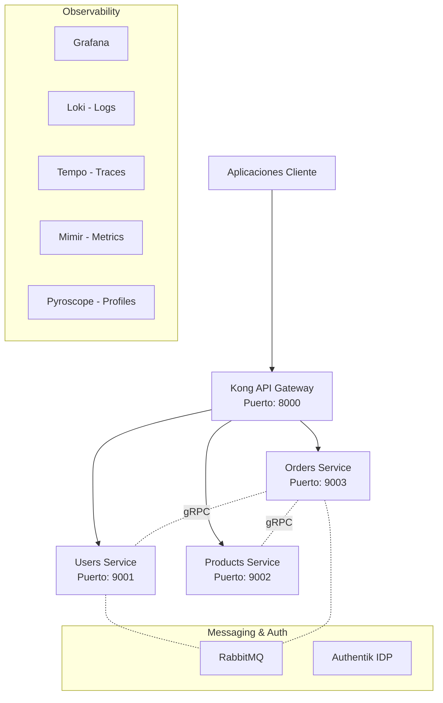

# Arquitectura de Microservicios E-commerce (NestJS)

[](https://nestjs.com/)
[](https://nodejs.org/)
[](https://docker.com/)
[](LICENSE)
[](https://deepwiki.com/bleidertcs/ecommerce-microservices)

Una arquitectura de microservicios e-commerce avanzada construida con **NestJS**, **gRPC**, **RabbitMQ**, **Authentik** (Identity Provider) y **Kong API Gateway**. El sistema cuenta con un stack de observabilidad completo (Loki, Tempo, Mimir, Pyroscope).

---

## 📚 Documentación Maestra

Para una guía detallada paso a paso sobre cómo configurar y usar todo el ecosistema, consulta:

👉 **[MASTER_GUIDE.md](./MASTER_GUIDE.md)**

Esta guía incluye configuración de **Authentik**, **Kong**, **Grafana** y ejemplos de **cURL** para todos los servicios.

---

## 🏗️ Descripción General de la Arquitectura

### Diagrama de Infraestructura



## 🚀 Características Principales

### 📦 Microservicios

- **👤 Users Service**: Gestión de perfiles, direcciones y métodos de pago.
- **🏷️ Products Service**: Catálogo de productos, inventario y gestión de reviews.
- **🛒 Orders Service**: Orquestación de pedidos con validación síncrona vía gRPC.

### 🛡️ Seguridad y Tráfico

- **🔐 Authentik IDP**: Gestión centralizada de identidades y autenticación OIDC.
- **🌐 Kong Gateway**: Enrutamiento, validación de JWT y Rate Limiting.
- **🔑 JWT Validation**: Validación en el Gateway mediante claves públicas RSA-256 de Authentik.

### 📊 Observabilidad (Stack Grafana)

- **📝 Logs (Loki)**: Logs estructurados recolectados por Promtail.
- **🕵️ Traces (Tempo)**: Rastreo distribuido completo mediante OTel Collector.
- **📈 Metrics (Mimir)**: Métricas RED y de sistema centralizadas.
- **🔥 Profiles (Pyroscope)**: Continuous profiling para optimización de rendimiento.

---

## ⚡ Inicio Rápido

### 1. Requisitos

- Docker & Docker Compose
- Node.js >= 18 (para desarrollo local)
- PowerShell o Bash para scripts de setup

### 2. Configuración y Despliegue Automático

El proyecto incluye scripts que automatizan la generación de protos, clientes prisma y el despliegue:

```bash
# En Windows (PowerShell)
./setup-ecommerce.ps1

# En Linux/macOS
chmod +x setup-ecommerce.sh
./setup-ecommerce.sh
```

### 3. Acceso a Herramientas

- **API Gateway**: `http://localhost:8000`
- **Authentik**: `http://localhost:9000`
- **Grafana**: `http://localhost:3000` (admin/admin)
- **RabbitMQ**: `http://localhost:15672` (admin/admin)

---

## 📚 Documentación Detallada

Para información técnica específica, consulta los siguientes documentos:

- 📑 **[Servicios E-commerce](./ECOMMERCE_SERVICES.md)**: Modelos de datos, API endpoints y flujos de comunicación.
- ⚙️ **[Recomendaciones Arquitecturales](./RECOMENDACIONES_ARQUITECTURA.md)**: Mejores prácticas y decisiones de diseño aplicadas.
- 🔐 **[Guía de Authentik](./AUTHENTIK_GUIDE.md)**: Configuración del proveedor de identidad y flujos de token.

---

## 🛠️ Desarrollo Local

```bash
# Ver logs de un servicio específico
docker-compose logs -f users-service

# Reiniciar stack de observabilidad
docker-compose restart prometheus grafana loki tempo mimir pyroscope
```

## 🤝 Contribuciones

Este proyecto utiliza un patrón de arquitectura hexagonal y Clean Architecture. Por favor, asegúrate de mantener la separación de capas al añadir nuevas funcionalidades.

---

© 2026 Backend Works. Licencia MIT.
