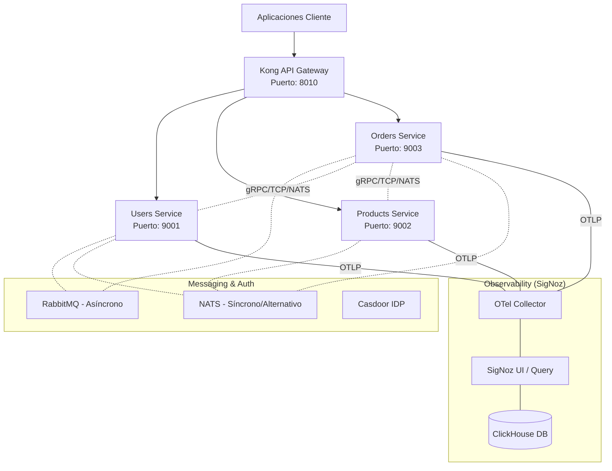

# Arquitectura de Microservicios E-commerce (NestJS)

[](https://nestjs.com/)
[](https://nodejs.org/)
[](https://docker.com/)
[](LICENSE)
[](https://deepwiki.com/bleidertcs/ecommerce-microservices)

Una arquitectura de microservicios e-commerce avanzada construida con **NestJS**, **gRPC**, **TCP**, **NATS**, **RabbitMQ**, **Casdoor** (Identity Provider) y **Kong API Gateway**. El sistema cuenta con un stack de observabilidad moderno basado en **SigNoz** y **OpenTelemetry**.

---

## 📚 Documentación Hub

| Documento                                                            | Descripción                                                        |
| :------------------------------------------------------------------- | :----------------------------------------------------------------- |
| 📖 **[MASTER_GUIDE.md](./MASTER_GUIDE.md)**                          | **Guía de Inicio Rápido** y configuración completa del ecosistema. |
| 🛡️ **[CASDOOR_KONG_GUIDE.md](./CASDOOR_KONG_GUIDE.md)**              | Detalles técnicos sobre la integración **Casdoor + Kong**.         |
| 📊 **[GUIA_OBSERVABILIDAD.md](./monitoring/GUIA_OBSERVABILIDAD.md)** | Configuración de **SigNoz**, logs, trazas y métricas.              |
| 🛠️ **[Scripts Guide](./scripts/README.md)**                          | Guía de **Scripts de Utilidad** (Setup, Stress, Auth).             |
| 📑 **[ECOMMERCE_SERVICES.md](./ECOMMERCE_SERVICES.md)**              | Referencia técnica de Microservicios, API y Modelos.               |
| ⚙️ **[RECOMENDACIONES.md](./RECOMENDACIONES_ARQUITECTURA.md)**       | Mejores prácticas y decisiones de arquitectura.                    |

---

## 🏗️ Descripción General de la Arquitectura

### Diagrama de Infraestructura



## 🚀 Características Principales

### 📦 Microservicios

- **👤 Users Service**: Gestión de perfiles, direcciones y métodos de pago.
- **🏷️ Products Service**: Catálogo de productos, inventario y gestión de reviews.
- **🛒 Orders Service**: Orquestación de pedidos con validación síncrona flexible vía **gRPC**, **TCP** o **NATS**.

### 🛡️ Seguridad y Tráfico

- **🔐 Casdoor IDP**: Gestión centralizada de identidades y autenticación OIDC.
- **🌐 Kong Gateway**: Enrutamiento, validación de JWT y Rate Limiting.
- **🔑 JWT Validation**: Validación en el Gateway mediante claves públicas RSA-256 de Casdoor.

### 📊 Observabilidad (SigNoz Native)

- **📝 Unified Logs**: Logs estructurados correlacionados automáticamente con trazas.
- **🕵️ Distributed Tracing**: Rastreo completo de peticiones entre microservicios mediante OpenTelemetry.
- **📈 Metrics**: Monitorización de rendimiento (RED metrics) y consumo de recursos.
- **⚡ Real-time Analysis**: Análisis de latencia y detección de anomalías basado en ClickHouse.

---

## 🛠️ Service Registry & Tools

| Componente             | Puerto Host | Descripción                        | Swagger / UI                              |
| :--------------------- | :---------- | :--------------------------------- | :---------------------------------------- |
| **API Gateway (Kong)** | `8010`      | Punto de entrada único para la API | -                                         |
| **Casdoor IDP**        | `8000`      | Proveedor de Identidad (Auth)      | [UI](http://localhost:8000)               |
| **Users Service**      | `9001`      | Microservicio de Usuarios          | [Swagger](http://localhost:9001/api/docs) |
| **Products Service**   | `9002`      | Catálogo de Productos              | [Swagger](http://localhost:9002/api/docs) |
| **Orders Service**     | `9003`      | Gestión de Pedidos                 | [Swagger](http://localhost:9003/api/docs) |
| **SigNoz**             | `8080`      | Observabilidad unificada           | [UI](http://localhost:8080)               |
| **RabbitMQ**           | `15672`     | Broker de Mensajería               | [UI](http://localhost:15672)              |

---

## ⚡ Inicio Rápido

### 1. Requisitos

- Docker & Docker Compose
- Node.js >= 18 (para desarrollo local)
- PowerShell o Bash para scripts de setup

### 2. Configuración y Despliegue Automático

El proyecto incluye scripts que automatizan la generación de protos, clientes prisma y el despliegue:

```bash
# En Windows (PowerShell)
./scripts/setup-ecommerce.ps1

# En Linux/macOS
chmod +x scripts/setup-ecommerce.sh
./scripts/setup-ecommerce.sh
```

### 3. Acceso a Herramientas

- **API Gateway (Proxy)**: `http://localhost:8010`
- **Casdoor (Auth/UI)**: `http://localhost:8000`
- **SigNoz UI**: `http://localhost:8080`
- **RabbitMQ UI**: `http://localhost:15672` (guest/guest)

---

## 📚 Documentación Detallada

Para información técnica específica, consulta los siguientes documentos:

- 📑 **[Servicios E-commerce](./ECOMMERCE_SERVICES.md)**: Modelos de datos, API endpoints y flujos de comunicación.
- ⚙️ **[Recomendaciones Arquitecturales](./RECOMENDACIONES_ARQUITECTURA.md)**: Mejores prácticas y decisiones de diseño aplicadas.
- 🔐 **[Guía Maestra](./MASTER_GUIDE.md)**: Configuración del proveedor de identidad (Casdoor), Kong y Observabilidad.
- 📉 **[Guía de Observabilidad](./monitoring/GUIA_OBSERVABILIDAD.md)**: Detalles sobre el stack de SigNoz y OTel.

---

## 🛠️ Desarrollo Local

```bash
# Ver logs de un servicio específico
docker-compose logs -f users-service

# Reiniciar stack de observabilidad
docker-compose restart signoz signoz-otel-collector clickhouse
```

## 🤝 Contribuciones

Este proyecto utiliza un patrón de arquitectura hexagonal y Clean Architecture. Por favor, asegúrate de mantener la separación de capas al añadir nuevas funcionalidades.

---

© 2026 Backend Works. Licencia MIT.
